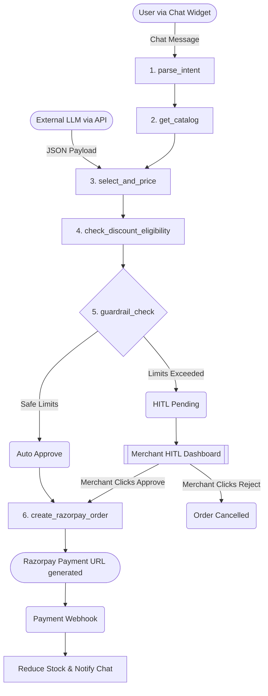

# AIBuyable

AIBuyable is an **Agentic Commerce Control Center**. It transforms traditional e-commerce stores into "AI-Buyable" merchants. By exposing a unified catalog, guardrails, and checkout API, AIBuyable allows external AI agents (like ChatGPT, Claude, or custom shopping bots) to seamlessly negotiate and purchase products on behalf of users, while keeping merchants strictly in control via an autonomous Human-in-the-Loop (HITL) system.

## 🚀 Key Features

- **Agentic Checkout Pipeline**: Powered by LangGraph, transactions are autonomously evaluated against merchant-defined guardrails.
- **Human-in-the-Loop (HITL) Inbox**: If an AI agent requests a discount that exceeds the merchant's guardrails, the order is intercepted and sent to a real-time HITL inbox for manual merchant approval.
- **External AI Manifests**: Exposes a `/.well-known/agentic-commerce.json` discovery manifest so third-party LLMs know exactly how to interact with the store.
- **Automated Catalog Crawling**: Built-in deep scraper that can crawl a merchant's existing website and automatically populate the product catalog.
- **Razorpay Integration**: Seamlessly generates and validates Razorpay payment links upon successful guardrail clearance.

## 🛒 Merchant Onboarding & Catalog Flow

AIBuyable makes it incredibly easy for traditional merchants to digitize their inventory and prepare for AI buyers:

1. **Sign Up & Keys**: The merchant creates an account and securely enters their Razorpay API keys (which are encrypted at rest using military-grade Fernet encryption).
2. **Deep Website Crawling**: Instead of manually entering products, the merchant can enter their existing website URL (e.g., `https://their-store.com`). AIBuyable's built-in deep scraper automatically crawls the site, extracts product names, prices, and images, and populates the PostgreSQL database.
3. **Setting Guardrails**: The merchant configures their risk tolerance (e.g., "Allow up to 15% discount automatically, but intercept anything over $1000 for manual review").
4. **Go Live**: The merchant's catalog is instantly accessible via the external AI API and the inbuilt chat widget!

---

## 🛠️ Technology Stack

- **Backend**: Python, FastAPI, SQLAlchemy, PostgreSQL, LangGraph, Google Gemini (LLM), Razorpay API.
- **Frontend**: React (Vite), TypeScript, CSS Variables (Custom Design System).
- **Security**: JWT Authentication, Fernet military-grade encryption for API keys.

---

## 🧠 LangGraph Agent Architecture

The core of AIBuyable is a stateful, directed acyclic graph (DAG) built with **LangGraph**. Whether a purchase request comes from the inbuilt AI Buyer chat widget or an external LLM via the API, it flows through the exact same rigorous pipeline.

### The Graph Nodes:

1. **`parse_intent`**
   - *Input:* User's raw text message (e.g., "I want a keyboard with 20% off").
   - *Action:* The LLM extracts the exact items, quantities, and requested discount percentages.
2. **`get_catalog`**
   - *Action:* Queries the PostgreSQL database to fetch the merchant's active, in-stock products.
3. **`select_and_price`**
   - *Action:* Cross-references the parsed intent with the actual catalog. Verifies stock availability and calculates the total mathematical amount.
4. **`check_discount_eligibility`**
   - *Action:* Validates the mathematical reality of the requested discount against the subtotal.
5. **`guardrail_check` (The Shield)**
   - *Action:* Fetches the merchant's configured `Guardrails` (e.g., max discount 15%, max auto-approve amount $1,000).
   - *Decision Point:* 
     - If the request is safe: Routes to `auto_approve`.
     - If the request breaks limits: Routes to `hitl_required`.
6. **`create_razorpay_order`**
   - *Action:* Connects to the Razorpay API to generate a real payment link.
7. **`escalate_to_hitl`**
   - *Action:* Pauses the graph. Creates a pending order in the merchant's HITL Inbox. The frontend chat begins polling. Once the merchant manually clicks "Approve", the graph resumes and triggers `create_razorpay_order`.

---

## 🔌 External AI Integrations

AIBuyable doesn't just provide a chat widget; it turns the store into an API for other LLMs. External bots can hit the following endpoints using the `merchant_id`:

- `GET /.well-known/agentic-commerce.json` - Discovery manifest.
- `GET /api/v1/agentic/catalog` - Token-lean product catalog.
- `GET /api/v1/agentic/guardrails` - Upfront disclosure of discount limits.
- `POST /api/v1/agentic/checkout` - Injects the external bot's request directly into the LangGraph pipeline at the `select_and_price` node.

## 📦 Setup & Installation

### Backend
1. Navigate to the `backend/` directory.
2. Create a Python virtual environment: `python -m venv venv`
3. Activate it and install dependencies: `pip install -r requirements.txt`
4. Copy `.env.example` to `.env` and fill in your PostgreSQL URL, Gemini API Key, and JWT Secret.
5. Start the server: `uvicorn app.main:app --reload`

### Frontend
1. Navigate to the `frontend/` directory.
2. Install dependencies: `npm install`
3. Start the Vite dev server: `npm run dev`

*(Note: The database tables and the default admin account `admin@aibuyable.com` are automatically seeded upon the first successful backend startup).*
